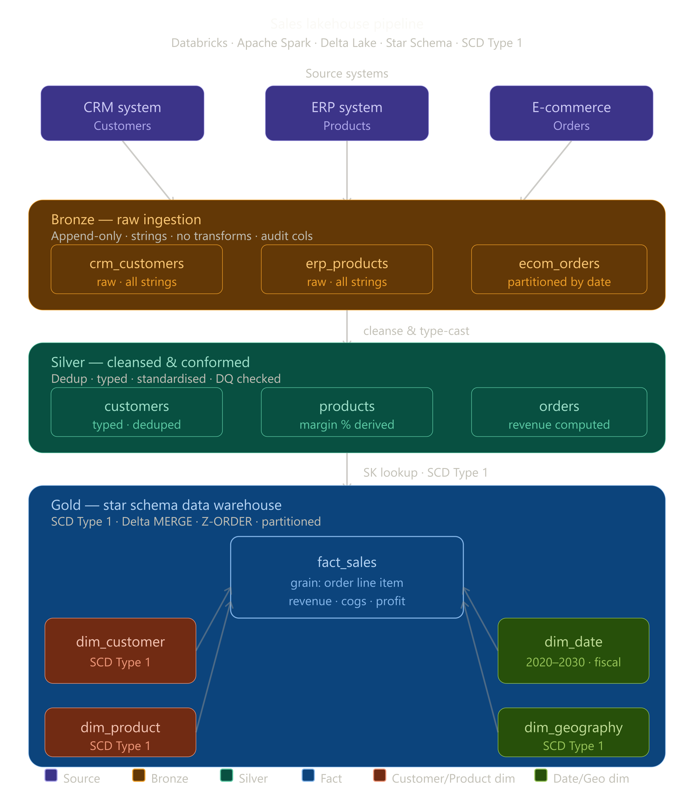

# 🏆 Sales Data Warehouse — Medallion Architecture (Databricks + Spark)

## Overview
Enterprise-grade Sales Data Warehouse using the **Medallion Architecture** (Bronze → Silver → Gold) on **Databricks** with **Apache Spark**, implementing a **Star Schema** with **SCD Type 1**.

---

## Architecture


---

## Project Structure

```
sales_dw_project/
│
├── config/
│   └── config.py               # All configs (paths, schema names, etc.)
│
├── notebooks/
│   ├── 00_setup.py             # Environment setup & database creation
│   ├── 01_bronze_ingestion.py  # Raw data ingestion (3 sources → Bronze)
│   ├── 02_silver_processing.py # Cleansing & standardization (Bronze → Silver)
│   ├── 03_gold_dimensions.py   # Dimension tables with SCD Type 1
│   ├── 04_gold_fact.py         # Fact table construction
│   └── 05_data_quality.py      # DQ checks & audit reports
│
├── utils/
│   ├── spark_utils.py          # Spark session helpers
│   ├── scd_utils.py            # SCD Type 1 merge logic
│   ├── dq_utils.py             # Data quality utilities
│   └── logger.py               # Logging setup
│
├── data/
│   └── source/
│       ├── crm_customers.csv    # Sample CRM data
│       ├── erp_products.csv     # Sample ERP data
│       └── ecom_orders.csv      # Sample E-Commerce data
│
├── tests/
│   └── test_transformations.py  # Unit tests
│
├── docs/
│   └── data_dictionary.md       # Schema documentation
│
└── README.md
```

---

## Star Schema Design

### Fact Table
| Table | Grain | Key Metrics |
|-------|-------|------------|
| `fact_sales` | One row per order line item | quantity, unit_price, discount_amount, net_revenue, gross_profit |

### Dimension Tables (SCD Type 1)
| Table | Description | SCD Strategy |
|-------|-------------|--------------|
| `dim_customer` | Customer details from CRM | SCD Type 1 (overwrite) |
| `dim_product` | Product catalog from ERP | SCD Type 1 (overwrite) |
| `dim_date` | Date/calendar dimension | Static (pre-generated) |
| `dim_geography` | City/Region/Country | SCD Type 1 (overwrite) |

---

## SCD Type 1 Strategy
- **No history is maintained** — when source data changes, target dimension row is **overwritten**
- Implemented using Spark **MERGE INTO** (Delta Lake)
- `updated_at` timestamp tracks when a record was last modified
- Surrogate keys generated using `monotonically_increasing_id()` + hash-based approach

---

## How to Run

### Prerequisites
- Databricks Runtime 12.0+ (with Delta Lake)
- Python 3.9+
- Apache Spark 3.3+

### Execution Order
```bash
# 1. Run environment setup
notebooks/00_setup.py

# 2. Ingest raw data into Bronze
notebooks/01_bronze_ingestion.py

# 3. Cleanse and process into Silver
notebooks/02_silver_processing.py

# 4. Build dimension tables (SCD Type 1)
notebooks/03_gold_dimensions.py

# 5. Build fact table
notebooks/04_gold_fact.py

# 6. Run data quality checks
notebooks/05_data_quality.py
```

---

## Industry Standards Applied
- ✅ Delta Lake for ACID transactions
- ✅ Medallion Architecture (Bronze / Silver / Gold)
- ✅ Star Schema for analytical queries
- ✅ SCD Type 1 via MERGE INTO
- ✅ Partitioning on date columns
- ✅ Z-ORDER optimization on high-cardinality join keys
- ✅ Data quality checks at each layer
- ✅ Audit columns (`created_at`, `updated_at`, `source_system`, `batch_id`)
- ✅ Centralized config management
- ✅ Structured logging

---

## Author
Built following Databricks Lakehouse best practices.
